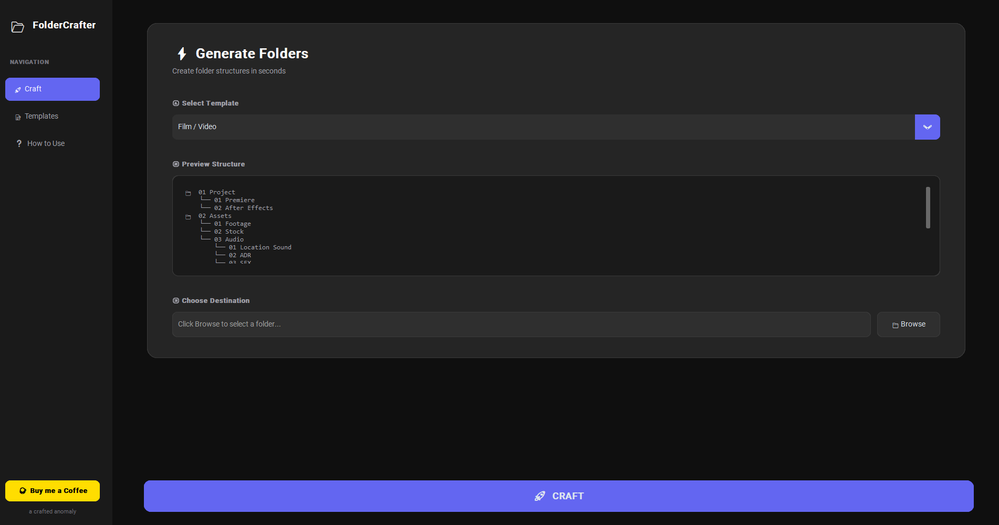

# FolderCrafter 📂

**Structured chaos. Organized brilliance.**

FolderCrafter is a modern, portable Windows application designed to generate complex folder structures in seconds. Built for developers, creatives, and digital architects who tired of creating folders one by one.



## ✨ Features

- **🚀 Lightning Fast:** Generate dozens of folders in a single click.
- **🎨 Modern UI:** A premium "crafted anomaly" aesthetic (Dark theme, Glassmorphism).
- **📦 Flexible Deployment:** Run as a portable `.exe` (no install) or install for Context Menu integration.
- **📝 Templates:** Create, edit, import, and export reusable JSON templates.
- **📂 Reverse Engineering:** Scan an existing folder to automatically generate a template from it.
- **🛡️ Secure:** Path traversal protection and safe file handling.

## 🛠️ Built With

- **Python 3.12**
- **CustomTkinter** (Modern UI library)
- **PyInstaller** (for building the executable)

## 📥 Download

You can download the latest portable executable from our website or the Release tab.

[**Download FolderCrafter for Windows**](https://craftedanomaly.gumroad.com/l/dhhijc)

## 💻 Development

### Prerequisites

- Python 3.10 or higher
- Git

### Installation & Running

1.  **Clone the repository:**
    ```bash
    git clone https://github.com/craftedanomaly/foldercrafter.git
    cd foldercrafter
    ```

2.  **Set up a virtual environment (Recommended):**
    ```bash
    # Windows
    python -m venv .venv
    .venv\Scripts\activate
    ```

3.  **Install dependencies:**
    ```bash
    pip install customtkinter
    ```

4.  **Run the application:**
    ```bash
    python main.py
    ```

## 🤝 Contributing

1.  Fork the Project
2.  Create your Feature Branch (`git checkout -b feature/AmazingFeature`)
3.  Commit your Changes (`git commit -m 'Add some AmazingFeature'`)
4.  Push to the Branch (`git push origin feature/AmazingFeature`)
5.  Open a Pull Request

## 📄 License

Distributed under the MIT License. See `LICENSE` for more information.

---

<p align="center">
  <a href="https://www.craftedanomaly.com">A Crafted Anomaly App</a> • 
  <a href="https://www.buymeacoffee.com/craftedanomaly">Support Development</a>
</p>
